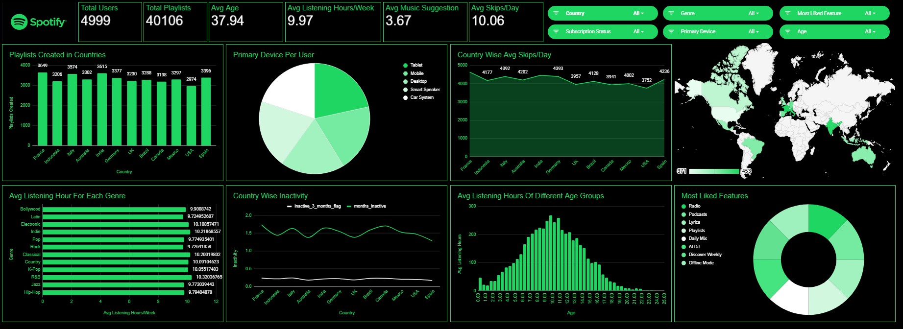

# Spotify User Behavior Analysis

## Project Overview
This project presents an in-depth analysis of a synthetic dataset designed to replicate user behavior on a Spotify-like music streaming platform, comprising 5,000 user records.

The primary objective of this analysis is to extract actionable insights across key areas, including user engagement patterns, subscription behavior and conversion dynamics, user churn and inactivity, and the effectiveness of advertisement strategies.

An interactive dashboard was developed using Google Sheets to facilitate structured exploration and visualization of the data. The dashboard enables clear interpretation of trends and supports data-driven decision-making by highlighting critical patterns in user behavior and platform performance.

---

## Data Source

The dataset used in this project is sourced from Kaggle.

- Platform: Kaggle  
- Dataset Name: Spotify User Behavior and Pattern  
- Dataset Link: https://www.kaggle.com/datasets/sahilislam007/spotify-user-behavior-and-pattern

---

## Dataset Information

- Total Records: 5000  
- Total Columns: 18  
- Data Type: Synthetic (realistic simulation)  
- Domain: Music Streaming / User Analytics  
- Platform Context: Spotify-like environment  
- File Format: CSV  

---

## Data Dictionary

| Column Name | Description | Data Type |
|------------|------------|----------|
| user_id | Unique identifier assigned to each user | Integer |
| country | Country where the user is located | String |
| age | Age of the user | Integer |
| signup_date | Date when the user signed up | Date |
| subscription_type | Type of plan (Free, Premium, Family, Student) | String |
| subscription_status | Indicates whether the subscription is Active or Inactive | String |
| months_inactive | Number of months the user has been inactive | Integer |
| inactive_3_months_flag | 1 = inactive ≥ 3 months, 0 = active/recent | Binary |
| ad_interaction | Indicates whether the user interacted with advertisements | Binary |
| ad_conversion_to_subscription | Indicates whether ad led to subscription conversion | Binary |
| music_suggestion_rating_1_to_5 | Rating given by user to music recommendations (1–5) | Integer |
| avg_listening_hours_per_week | Average weekly listening time in hours | Float |
| favorite_genre | User’s preferred music genre | String |
| most_liked_feature | Feature most liked by the user (e.g., Playlists, Radio, AI DJ) | String |
| desired_future_feature | Feature user wants in the future | String |
| primary_device | Device used for streaming (Mobile, Desktop, Tablet, etc.) | String |
| playlists_created | Number of playlists created by the user | Integer |
| avg_skips_per_day | Average number of songs skipped per day | Float |

##Key Features of the Dashboard##

- Comprehensive KPI section highlighting total users, total playlists, average age, average listening hours, average music suggestions, and average skips per day
- Country-wise analysis of playlist creation to identify regional engagement patterns
- Visualization of device usage distribution across multiple platforms
- Comparative view of average skips per day across different countries
- Analysis of user inactivity trends across regions
- Breakdown of average listening hours by age group to understand demographic behavior
- Genre-wise analysis of average listening hours to capture music preferences
- Insights into overall genre popularity across the user base
- Identification of most liked platform features
- Interactive filtering capabilities enabling dynamic analysis based on country, subscription status, age, genre, device, and user preferences

Designed to provide a holistic view of user behavior and enable intuitive, data-driven exploration.

---

## Exploratory Data Analysis (EDA)

### User Distribution

User presence is well distributed across multiple countries, indicating a globally balanced dataset. However, certain regions demonstrate higher levels of playlist creation and engagement, suggesting stronger platform adoption.

### Device Usage

Users access the platform through a variety of devices, including mobile, desktop, tablet, and smart systems. Mobile and tablet devices account for the majority of usage, highlighting the importance of optimizing the mobile experience.

### Advertisement Interaction

A significant proportion of users show low interaction with advertisements. The gap between ad engagement and non-engagement suggests opportunities to improve ad targeting and relevance.

### Inactivity Trends

Among inactive users, two distinct patterns emerge: users who have been inactive for more than three months and those who have recently become inactive. This segmentation can support more targeted re-engagement strategies.

### Churn Analysis

The majority of users remain active, indicating healthy retention levels. However, the presence of inactive users highlights the need for continuous monitoring and proactive churn mitigation strategies.

### Genre Preferences

User preferences are diverse, with genres such as Pop, Rock, and Indie demonstrating relatively higher engagement. This reinforces the need for a robust and adaptive recommendation system.

### Playlist Behavior

Playlist creation varies across countries, with higher counts in certain regions reflecting stronger user engagement and content personalization behavior.

---

## Key Analytical Questions

- Which countries demonstrate the highest levels of user engagement and playlist creation?
- Which devices are most frequently used for music streaming across the user base?
- Which age group contributes the highest average listening hours?
- What proportion of users become inactive, and how many remain inactive beyond three months?
- What is the overall churn rate based on inactive user segments?
- Which music genres show the highest levels of popularity and engagement?
- How does user behavior vary across different subscription types?

These questions guided the analysis and helped uncover meaningful patterns in user engagement, retention, and platform performance.

---

## Use Cases

- Analyzing user engagement patterns to enhance overall platform experience and personalization
- Identifying churn and supporting the development of effective retention strategies
- Evaluating marketing performance, particularly advertisement effectiveness and user interaction
- Optimizing subscription conversion through data-driven insights
- Enabling customer segmentation based on behavioral patterns and user preferences
- Delivering clear, interactive data visualization for informed decision-making and reporting

These use cases demonstrate how data can be leveraged to drive strategic improvements across user experience, marketing, and business performance.

---
## Dashboard

## Disclaimer

This dataset is synthetically generated for educational purposes and does not contain real user data from Spotify. It is designed to simulate realistic behavior patterns for analysis and learning.

---

## Conclusion

This dashboard provides a comprehensive view of user behavior on a music streaming platform. It highlights key insights related to user engagement, subscription patterns, churn, and advertisement effectiveness.

The analysis shows that while most users remain active, there is potential to improve ad engagement and conversion rates. Additionally, understanding user preferences such as genre and device usage can help enhance personalization and overall user experience.

This project demonstrates how data visualization and dashboarding can be effectively used to derive actionable business insights.

